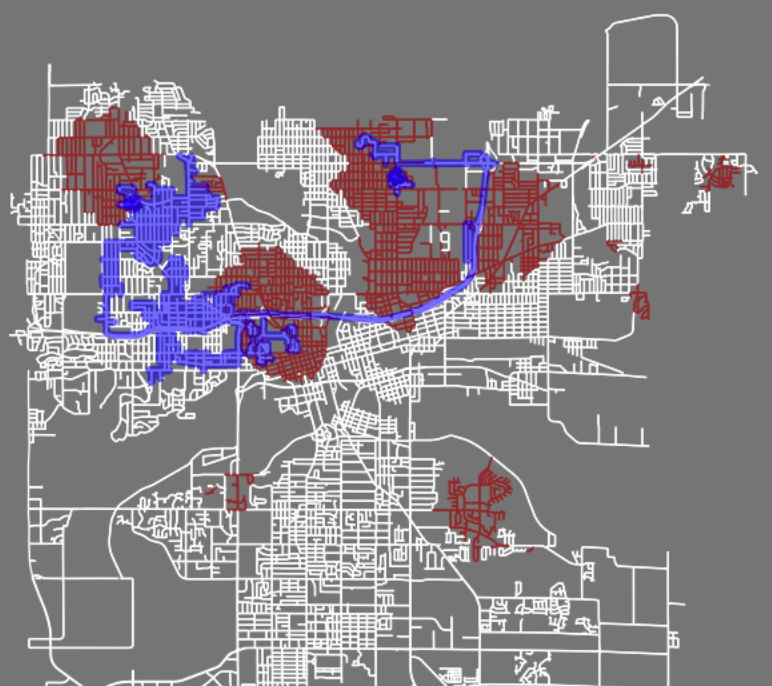

# CS143-SP26-P1: Street Sweeper World Lab

This notebook demonstrates how to make an AI agent which interacts with a simulated street network environment to clean streets. It's like the Vacuum World example in the Russell-Norvig text, but on a real-world street map.
<!---->

  

